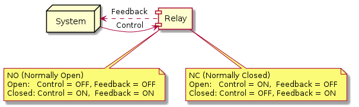
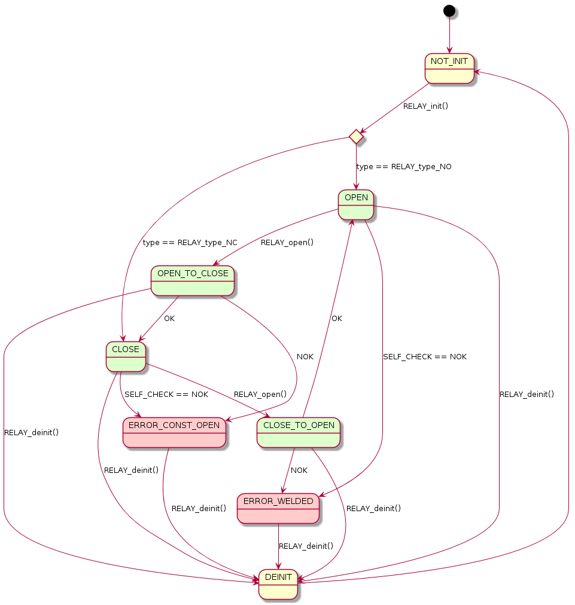

# relay

Demo project for operating and monitoring electrical relays.
System/User controls relay by DO (Digital Output) line - "Control" and monitor its state by DI (Digital Input) line - "Feedback" (might be optional).
"ON"/"OFF" are DI/DO logical states which represent real voltage values on the lines and depend on relay and system configuration (for e.g. 12V (high) corresponds "ON" and  0V (GND, low) to
"OFF").

## Relay state diagram
Describes relay states including error states as well: "ERROR_CONST_OPEN" - relay is constantly open and couldn't be closed, "ERROR_WELDED" - relay is welded and couldn't be open.

## Relay sequence diagram

## Simulation
Project provides simulation for correct and wrong modes to cover different test cases.
Log examples from simulation runs: [logs](logs)
